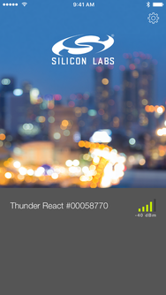
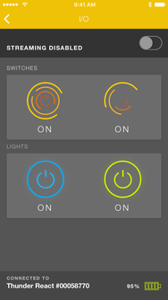
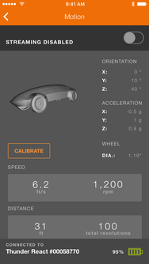
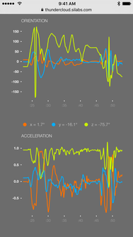

# ThunderBoard

ThunderBoard is an app for demonstrating the capabilities of the ThunderBoard-React sensor board. It includes Motion, Environment, and I/O demos. ThunderBoard is a native iOS app written in Swift 2.0.

Source code for the [Android app](https://github.com/SiliconLabs/thunderboard-react-android) and [Firebase web interface](https://github.com/SiliconLabs/thundercloud) is also available.

# Screenshots

## Bluetooth

Bluetooth Low Energy (BLE) is used to communicate with the ThunderBoard-React device. A device that supports BLE is required to run the ThunderBoard software.

Because the iOS Simulator doesn't support BLE, device interaction is abstracted through protocols. Simulated and Core Bluetooth implementations are injected at runtime, depending on where the app is running. Communication with a real device is not possible inside the simulator, but many of the features of the application can be demonstrated nonetheless.

## Beacons

When powered on, ThunderBoard-React devices broadcast an iBeacon-compatible service, making it possible to be notified of a nearby device automatically.

There are a few things about beacons to keep in mind:

1. Events are only triggered when you ​_cross_​ a region boundary (think entering or leaving a beacon’s broadcast range.

	For example, if you’re using a ThunderBoard and then power cycle it hoping to see a beacon, you won’t receive it. Empirical testing shows that the ThunderBoard needs to be powered off for around 30 seconds before iOS will notify the application that it has left the region. After that, re-entering the region (powering the ThunderBoard on) will produce an alert as expected.

2. You’ll only receive notifications if the iOS device’s screen is on. The BLE radio scans for beacons while the screen is on.

3. Notifications are not displayed if the application is running in the foreground.

## Cloud Streaming

Each ThunderBoard demo can stream realtime data to the cloud. While streaming, the web URL displays live-updating graphs for each characteristic of the demo. After a demo concludes, summary data is shown.

The cloud streaming feature is built with [Firebase](https://www.firebase.com). In order to enable support, you need to update the configuration values in `ApplicationConfig.swift`. Specifically, the `FirebaseIoHost`, `FirebaseDemoHost`, and `FirebaseToken` items need to be updated. Without these values, the streaming feature will be disabled.

### Cloud Data

The format for data sent to Firebase is documented inside the web application [README](https://github.com/SiliconLabs/thunderboard-react-web/blob/master/README.md).

### Short URLs

ThunderBoard attempts to shorten all demo URLs with the [is.gd](http://is.gd) URL shortening service. URL stats are not supported, so no credentials are required for the URL shortener. Additional URL shorteners may be easily supported by providing a class conforming to the `UrlShortener` protocol.

# Building the code

_The ThunderBoard project is written in Swift 2, and thus requires Xcode 7.0 or newer._

1. Download Xcode from the Mac App Store or from the [developer tools site](https://developer.apple.com/xcode/downloads/).
2. Open `ThunderBoard.xcodeproj` in Xcode
3. Build the `Thunderboard` scheme

## Configuration Values

Inside the Xcode project, the `ApplicationConfig.swift` file contains configuration values that need to be provided in order for certain features of the application to be enabled (namely, realtime streaming and Hockey crash reporting). In order to stream realtime data to your own Firebase instance, you'll need to update the following items with your own configuration value:

	// Firebase IO Host ("your-application-0001.firebaseio.com")
    class var FirebaseIoHost: String {
        get { return "" }
    }
    
    // Firebase web app host ("your-application-0001.firebaseapp.com")
    class var FirebaseDemoHost: String {
        get { return "" }
    }

    // Firebase token (40 character string from your Firebase account)
    class var FirebaseToken: String {
        get { return "" }
    }
    

